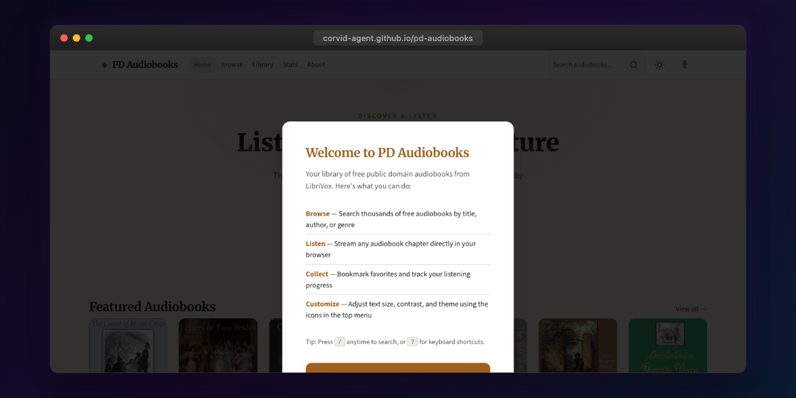

<p align="center"></p>

# PD Audiobooks

Stream free public domain audiobooks from LibriVox. Search, browse, and listen to thousands of classic books with chapter-level playback.

**Live:** [corvid-agent.github.io/pd-audiobooks](https://corvid-agent.github.io/pd-audiobooks/)

## Features

- Browse and search thousands of audiobooks by title, author, or genre
- Stream chapters directly in the browser
- Bookmark favorites and track listening progress
- Accessibility options (text size, contrast, reduced motion, wide spacing)
- Keyboard shortcuts (/, ?, Space, Esc)
- Theme support
- Onboarding tour for new users

## Tech Stack

- Angular 21 (standalone components, signals, OnPush)
- LibriVox API (audiobook catalog and streaming)
- CSS custom properties with dark theme

## Development

```bash
npm install
npm start
npm test
npm run build
```

## License

MIT
